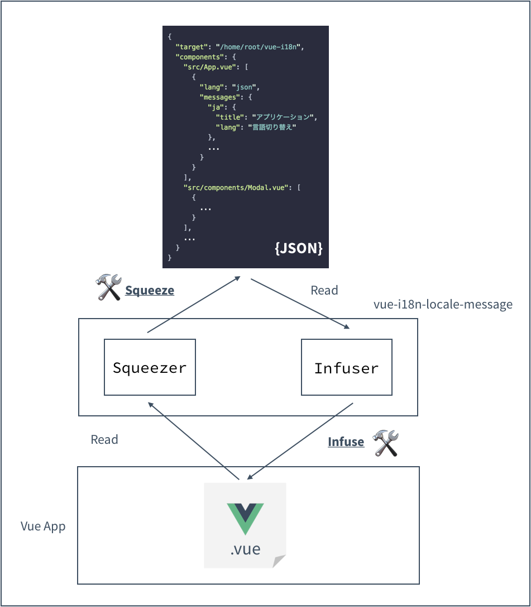
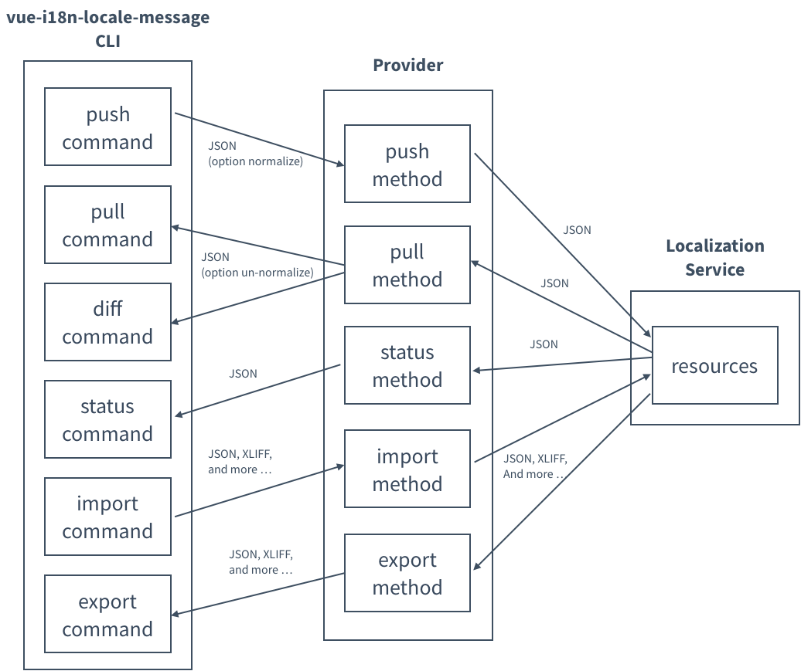

# :globe_with_meridians: vue-i18n-locale-message

[](https://www.npmjs.com/package/vue-i18n-locale-message)

i18n locale messages management tool / library for vue-i18n

## :warning: NOTICE
Currently version is supported [vue-i18n@v8.x](https://github.com/kazupon/vue-i18n) (for Vue 2.x)

[vue-i18n-next](https://github.com/intlify/vue-i18n-next) (for Vue 3.x) isn't supported yet.

## :raising_hand: Motivations

The big motivation is as follows.

- :tired_face: Hard to integrate locale messages for localization services
- :tired_face: Hard to maintain consistency of locale message keys (`eslint-plugin-vue-i18n` need it!)
- :pray: Requested by 3rd vendor tools (`i18n-ally` and etc ...)

## :cd: Installation

### npm

```sh
npm install --save-dev vue-i18n-locale-message
```

If you can globally use CLI only, you need `-g` option the below command.

```sh
npm install -g vue-i18n-locale-message
```

### yarn

```sh
yarn add -D vue-i18n-locale-message
```

If you can globally use CLI, you need `global` option the below command.

```sh
yarn global add vue-i18n-locale-message
```

## :star: Features

- API
  - squeeze the meta of locale messages from `i18n` custom block
  - infuse the meta of locale messages to `i18n` custom block
  - get translation status from localization service
  - diff locale messages between local and localization service
  - push the locale messages to localization service
- CLI
  - squeeze: squeeze the locale messages from `i18n` custom block
  - infuse: infuse the locale messages to `i18n` custom block
  - push: push the locale messages to localization service
  - pull: pull the locale mesagees from localization service
  - diff: diff locale messages between local and localization service
  - status: indicate translation status from localization service
  - import: import locale messages to localization service
  - export: export locale messages from localization service
  - list: list undefined fields in locale messages

## :rocket: Usages

### API

```js
const fs = require('fs')
const { squeeze, infuse } = require('vue-i18n-locale-message')

// read single-file component contents
// NOTE: about scheme of target contents, see the `SFCInfo` type at `types/index.d.ts
const files = [
  {
    path: '/path/to/src/components/Modal.vue',
    content: `<template>
    ...
    <i18n>
    {
      ...
    }
    <i18n>`
  },
  // ...
]

// squeeze meta locale message from single-file components
// NOTE: about scheme of meta locale message, see the `MetaLocaleMessage` type at `types/index.d.ts`
const meta = squeeze('/path/to/src', files)

// write squeezed meta locale messages
fs.writeFileSync('/path/to/src/meta.json', JSON.stringify(meta))

// after update meta locale message with 3rd vendor tools or your code, it read meta locale messsage
const updatedMeta = require('/path/to/src/updated-meta.json')

// infuse meta locale message to single-file components
const updatedFiles = infuse('/path/to/src', files, updatedMeta)

// write updated single-file component
updateFiles.forEach(file => {
  fs.writeFileSync(file.path, file.content)
})
```

### CLI
#### Squeeze

```sh
vue-i18n-locale-message squeeze --target=./src --output=./messages.json
```

#### Infuse

```sh
vue-i18n-locale-message infuse --target=./src --locales=./translated.json
```

#### Push

```sh
vue-i18n-locale-message push --provider=l10n-service-provider \
  --conf=110n-service-provider-conf.json \
  --target-paths=./src/locales/*.json \
  --filename-match=^([\\w]*)\\.json
```

#### Pull

```sh
vue-i18n-locale-message pull --provider=l10n-service-provider \
  --conf=110n-service-provider-conf.json \
  --output=./src/locales
```

#### Diff

```sh
vue-i18n-locale-message diff --provider=l10n-service-provider \
  --conf=110n-service-provider-conf.json \
  --target-paths=./src/locales/*.json \
  --filename-match=^([\\w]*)\\.json
```

#### Status
```sh
vue-i18n-locale-message status --provider=l10n-service-provider \
  --conf=110n-service-provider-conf.json
```

### Import

```bash
$ vue-i18n-locale-message import --provider=l10n-service-provider \
    --conf ./l10n-service-provider-conf.json \
    --target=./src/locales/ja.json \
    --format=json
```

### Export

```bash
$ vue-i18n-locale-message export --provider=l10n-service-provider \
    --conf ./l10n-service-provider-conf.json \
    --output=./src/locales
```

#### list

```sh
vue-i18n-locale-message list --locale=en \
  --target-paths=./src/locales/*.json \
  --filename-match=^([\\w]*)\\.json
```


## :red_car: Exit codes

| Codes | Description                                                          |
|-------|----------------------------------------------------------------------|
| 4     | Not completed localization                                           |
| 5     | There are undefined fields in locale messages                        |
| 64    | difference between local and localization services                   |


## :book: API: Specifications

<p align="center"></p>


### sqeeze (basePath: string, files: SFCFileInfo[]): MetaLocaleMessage

  * **Arguments:**
    * `{string} basePath`: The base path that single-file components are located in project
    * `{SFCFileInfo[]} files`: The target single-file components information
  * **Return:** `MetaLocaleMessage`

Squeeze the meta of locale messages from i18n custom block at single-file components. 

In about structure of the meta information that is returned with this function, You can see the [here](https://github.com/kazupon/vue-i18n-locale-message/blob/master/types/index.d.ts#L34-L81).

### infuse (basePath: string, sources: SFCFileInfo[], meta: MetaLocaleMessage): SFCFileInfo[]

  * **Arguments:**
    * `{string} basePath`: The base path that single-file components are located in project
    * `{SFCFileInfo[]} sources`: The target single-file components information
    * `{MetaLocaleMessage}`: The meta of locale message
  * **Return:** `SFCFileInfo[]`

Infuse the meta of locale messages to i18n custom block at single-file components.

`infuse` function will return new single-file components information that is updated with the single-file components information specified as `sources` and  the meta of locale message as `meta`.

### status (options: TranslationStatusOptions): Promise<TranslationStatus[]>

  * **Arguments:**
    * `{options}
      * `provider`: The target localization service provider, required, same `provider` option of `status` command
      * `conf`: The json file configration of localization service provider, same `conf` option of `status` command
      * `locales`: For some locales of translation status, same `locales` option of `status` command
  * **Return:** `Promise<TranslationStatus[]>`


## :book: Provider: Specifications

You can use the `push` or `pull` commands to push the locale message to the localization service as a resource for that service, and also to pull resources from the l10n service as the locale message.

<p align="center"></p>

When you run the following commands,

  - `push`
  - `pull`
  - `diff`
  - `status`
  - `import`
  - `export`

you need the provider that implements the following.

- export provider factory function
- provider factory function must return a provider object that have the following I/F:
  - `push` method
  - `pull` method
  - `status` method
  - `import` method
  - `export` method

The type definition with TypeScript is as follows:

```ts
/**
 *  Provider factory function
 */
type ProviderFactory<T = {}> = (configration: ProviderConfiguration<T>) => Provider

/**
 *  Translation Status
 */
export type TranslationStatus = {
  locale: Locale  // target locale
  percentage: number  // translation percentage
}

/**
 *  Raw Locale Message
 */
export type RawLocaleMessage = {
  locale: Locale  // target locale
  format: string  // locale message format
  data: Buffer    // data of locale message
}

/**
 *  Provider interface
 */
interface Provider {
  /**
   * push the locale messsages to localization service
   */
  push (args: PushArguments): Promise<void>
  /**
   * pull the locale messages from localization service
   */
  pull (args: PullArguments): Promise<LocaleMessages>
  /**
   * indicate translation status from localization service
   */
  status (args: StatusArguments): Promise<TranslationStatus[]>
  /**
   * import the locale messsages to localization service
   */
  import (args: ImportArguments): Promise<void>
  /**
   * export the locale message buffer from localization service
   */
  export (args: ExportArguments): Promise<RawLocaleMessage[]>
}

type CommonArguments = {
  dryRun: boolean // whether the CLI run as dryRun mode
  normalize?: string // normalization ways for locale messages or resource
}

/**
 *  Provider Push Arguments
 */
type PushArguments = {
  messages: LocaleMessages // the locale messages that push to localization service
} & CommonArguments

/**
 *  Provider Pull Arguments
 */
type PullArguments = {
  locales: Locale[] // locales that pull from localization service, if empty, you must pull the all locale messages
} & CommonArguments

/**
 *  Provider Status Arguments
 */
export type StatusArguments = {
  locales: Locale[] // locales that indicate translation status from localization service, if empty, you must indicate translation status all locales
}

/**
 *  Provider Import Arguments
 */
export type ImportArguments = {
  messages: RawLocaleMessage[]  // the raw locale messages that import to localization service
} & CommonArguments

/**
 *  Provider Export Arguments
 */
export type ExportArguments = {
  locales: Locale[] // locales that export from localization service, if empty, you must export all locale messages
  format: string    // locale messages format
} & CommonArguments

/**
 *  ProviderConfiguration provider fields structure
 *    e.g.
 *    {
 *      "provider": {
 *        "token": "xxx"
 *      }
 *    }
 */
interface ProviderConfiguration<T = {}> {
  provider: { [key in keyof ProviderConfigurationValue<T>]: ProviderConfigurationValue<T>[key] }
}

type ProviderConfigurationValue<T = {}> = T & { [prop: string]: unknown }
```

As an implementation example of Provider, there is [`poeditor-service-provider`](https://github.com/kazupon/poeditor-service-provider) implemented as localization service provider of poeditor.

## :notebook: CLI: Locale message squeezing rules

The structure of locale messages to be squeezed is layered with the **directory structure** and **single-file component (`.vue`) filename**.

This repotitory `demo` project directory structure:

```sh
cd demo
tree src
src
├── App.vue
├── components
│   ├── Modal.vue
│   └── nest
│       └── RankingTable.vue
├── i18n.js
├── locales
│   ├── en.json
│   └── ja.json
├── main.js
└── pages
    └── Login.vue

4 directories, 8 files
```

You use `vue-cli-locale-message` CLI, run `squeeze` command as follows:

```sh
vue-i18n-locale-message squeeze --target=./src --output=./messages.json
cat ./messages.json
```

You will get the following JSON structure (the following output results are commented To make it easier to understand):

```json5
{
  "ja": { // for `ja` locale`
    "App": { // src/App.vue
      "title": "アプリケーション",
      "lang": "言語切り替え"
    },
    "components": { // src/components
      "Modal": { // src/components/Modal.vue
        "ok": "OK",
        "cancel": "キャンセル"
      }
    },
    "pages": { // src/pages
      "Login": { // src/pages/Login.vue
        "id": "ユーザーID",
        "password": "パスワード",
        "confirm": "パスワードの確認入力",
        "button": "ログイン"
      }
    }
  },
  "en": { // for `en` locale
    "App": { // src/App.vue
      "title": "Application",
      "lang": "Change languages"
    },
    "components": { // src/components
      "Modal": { // src/components/Modal.vue
        "ok": "OK",
        "cancel": "Cancel"
      },
      "nest": { // src/components/nest
        "RankingTable": { // src/components/nest/RankingTable.vue
          "headers": {
            "rank": "Rank",
            "name": "Name",
            "score": "Score"
          }
        }
      }
    }
  }
}
```

## :scroll: Changelog
Details changes for each release are documented in the [CHANGELOG.md](https://github.com/kazupon/vue-i18n-locale-message/blob/master/CHANGELOG.md).


## :exclamation: Issues
Please make sure to read the [Issue Reporting Checklist](https://github.com/kazupon/vue-i18n-locale-message/blob/master/.github/CONTRIBUTING.md#issue-reporting-guidelines) before opening an issue. Issues not conforming to the guidelines may be closed immediately.

## :white_check_mark: TODO
Managed with [GitHub Projects](https://github.com/kazupon/vue-i18n-locale-message/issues?q=is%3Aissue+is%3Aopen+label%3Atodo)

## :copyright: License

[MIT](http://opensource.org/licenses/MIT)
